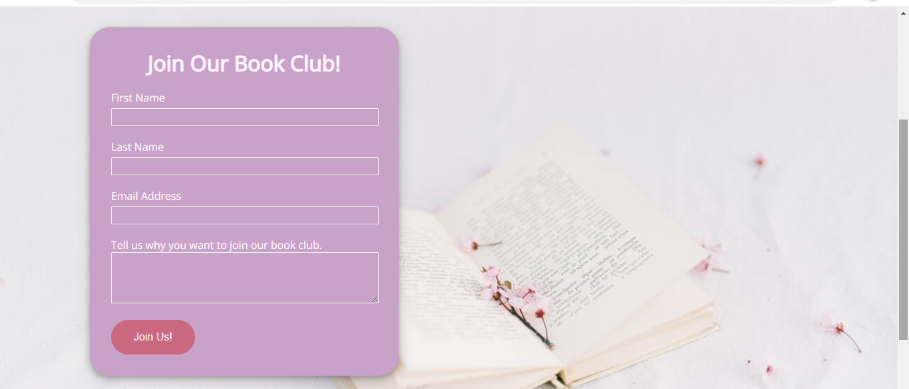

# I'd Rather Be At Pemberley
I'd Rather Be At Pemberley is a website for an online book club that meets once a month ran in Ireland. It hopes to provide users who have a love of reading and Jane Austen a place to join and meet up with other Austen fans to read and review similar regency romance books each month.

[I'd Rather Be At Pemberley](https://lisamolloy5.github.io/id-rather-be-at-pemberley/index.html)

---
# Table Of Contents
 * [User Experience](##user-experience)
    1. [User Stories](###user-stories)
    2. [Design](###design)
    3. [Wireframes](###wireframes)
 * [Features](##features)
    1. [Navigation Menu](####navigation-menu)
    2. [About The club](####about-the-club)
    3. [What We Are Reading](####what-we-are-reading)
    4. [Footer](####footer)
    5. [Events Page](####events-page)
    6. [Sign Up Page](####sign-up-page)
    7. [Future Features](###future-feature)
 * [Technology Used](##technology-used)
 * [Deployment](#deployment)
 * [Testing](#testing)
 * [Credit](#credit)
   1. [Code Used](##code-used)
   2. [Content](##content)
   3. [Media](##media)
 * [Acknowledgements](##acknowledgements)

---
## User Experience
---
### User Stories
---
#### First Time Visitor Goals
* As a first time visitor, I want to easily navigate the site.
* As a first time visitor, I want To find information on the book club, what type of books read and where it takes place.
* As a first time visitor, I want to easily find their social media links.

#### Returning Visitor Goals
* As a returning visitor, I want to fine how I can join the book club.
* As a returning visitor, I want to easily find contact information if I have queries before joining the book club.

#### Frequent User Goals
* As a first time visitor, I want to be able to check for any upcoming book club events.
* As a first time visitor, I want to be able to check what book the book club is currently reading before attending the meet up.

### Design
---
#### Colour Scheme
The colour scheme of the website is various shades of off white, pinks and lilac. These were chosen as they are colours that convey themes of romance and regency.

#### Typography 
* 'Allura' was used as the title font for the website as it is formal and suits the websites regency theme. 
* 'Open Sans' was used as the main font for the website content as it is a good choice for web and mobile interfaces and has a friendly appearance. Sans Serif was used as the fallback font for the website in case the other fonts do not load properly.
#### Imagery
The images used on the website contain books and flowers to convey the webistes purpose as a romance book club.

### Wireframes

---
## Features
#### Navigation Menu
* The website logo sits at the top of the websites pages and is linked with the home so that when it is clicked the user is brought back to the home page.
* The navigation bar sits below the logo and is fully responsive. A border with a pink background colour encases the page title depending on the page of the website the user is on.

#### About The Club
* Located beneath the home page hero image.
* Provides information on the books club such as who the book club is for and when and where the events happen.
* A image of Jane Asuten's book sits between the information to contribute to the regency book club theme of the website.

#### What we are reading 
* Located beneathe the about the club section. 
* give the user details on what the book club is reading currently.
* It contains the book title and book cover image.

#### Footer
* Located at the bottom of each page of the webite.
* Provides contact information and social media links.

#### Events Page
* The events page provides the user with the information on upcoming events.
* Each section includes a book title, book cover, short synopsis of the book and link to the goodreads page on the book.
* The goodreads link changes from black to pink when a mouse hovers on it.

#### Sign up page
* The signup form has four input fields first name, last name, email and a section for the user to write about why they want to join the book club.
* A image of a book is the covers the background of the join page.

---
### Future Feature
* A blog page containing various articles on regency genre books, book adaptations and book revies.

---

## Technology Used
---
* [HTML5](https://en.wikipedia.org/wiki/HTML5) was used to 
* [CSS3](https://en.wikipedia.org/wiki/CSS)
* [Balsamiq](https://balsamiq.com/) was used to create the website wireframes.
* [Tinyjpg](https://tinyjpg.com/) was used to compress images.
* [Font Awesome](https://fontawesome.com/) was used to for the icons on the website.
* [Google Fonts](https://fonts.google.com/) was used for the fonts on the website.
* [Gitpod](https://www.gitpod.io/) was used to write and edit to code.
* [Github](https://github.com/) was used to host and deploy the website.
---

# Deployment
#### Github deployment
This project was deployed to GitHub Pages. To deploy 

1. Log in or join GitHub.
2. Find the GitHub Repository.
3. Locate the setting part of thr Repository menu.
4. Find the pages part of settings and click it.
5. Click the 'source' dropdown named 'none' and change it to 'Master Branch.
6. Click save.
7. The page will refresh automatically with the successfully deployed website.

Link to the GitHub repository [I'd Rather Be At pmberley Repository](https://github.com/LisaMolloy5/id-rather-be-at-pemberley)

#### Fork the Repository#

1. Log in or join GitHub.
2. Find the GitHub Repository.
3. Locate the Fork buuton at the top left of the repository.
4. Click the Fork button and you should have a copy of the original reposirtory.

#### Make a local clone of the Repository

1. Log in or join Github.
2. Fnd the Github repository.
3. Locate the 'Code' button dropdown and click it.
4. Select 'HTTPS' to clone using HTTPS and copy the link or click the clipboard button.
5. Open Git Bash.
6. Replace the current working directory to the location you wish the cloned directory to be made.
7. Type git clone, and paste the URL from copied in step 4.

---
# Testing
Please find the informaton on testng the 'I'd Rather Be At Pemberley' website [here](TESTING.md).
---
## Credit
---
### Code Used
* [For css animation](https://www.w3schools.com/css/tryit.asp?filename=trycss3_animation1)

* [Creating a centered horizontal Navigation](https://csswizardry.com/2011/01/create-a-centred-horizontal-navigation/)

* [Float an Image Without Text Wrapping Using CSS Flex ](https://www.youtube.com/watch?v=e2RQM4pE8uI)

* [Creating a Simple Footer With Flexbox](https://www.youtube.com/watch?v=UOnFJ6tu3PY)

* [A Complete Guide to Flexbox](https://css-tricks.com/snippets/css/a-guide-to-flexbox/)

* [CSS Box Shadow](https://www.w3schools.com/csS/css3_shadows_box.asp)

---

## Content
* All content was written by the developer.
* Book sysnopses were taken from back of the books.

## Media
* Hero Images from [Unsplash](https://unsplash.com/) user [Sixteen Miles out](https://unsplash.com/@sixteenmilesout)
* About The Club image from [Pexels](https://www.pexels.com/) user [Leah Kelly](https://www.pexels.com/@leah-kelley-50725)
* Join page cover image from [Pexels](https://www.pexels.com/) user [Olya Kobruseva](https://www.pexels.com/@olyakobruseva)
* Book Cover images from the developer, [Lisa Molloy](https://www.linkedin.com/in/lisa-molloy-b30565163/)

## Acknowledgements
* I would like to thank [Precious Ijege](https://www.linkedin.com/in/precious-ijege-908a00168/) my mentor for his continuous help throughout my project.
* I would like to thank my tutor 
* I would also lik to thank the Slack Community for the feedback and help provided.

2022 Lisa Molloy

