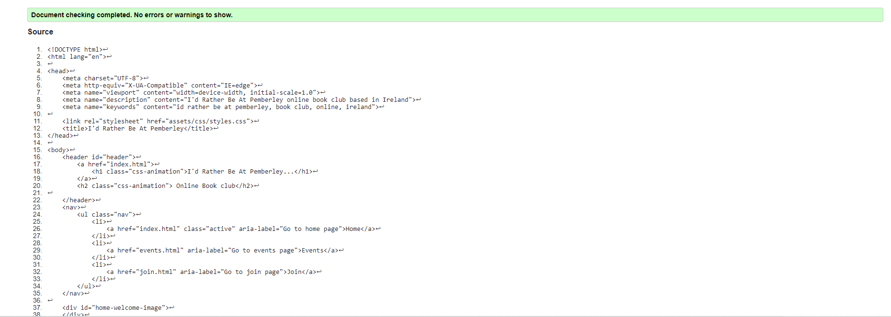
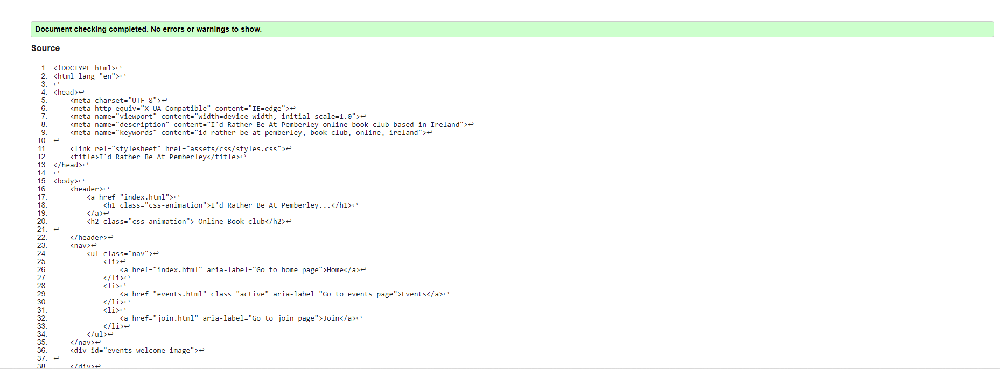
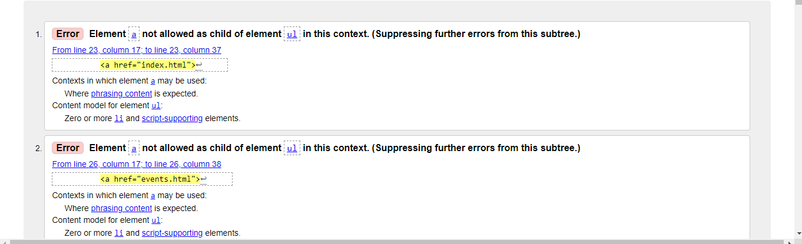
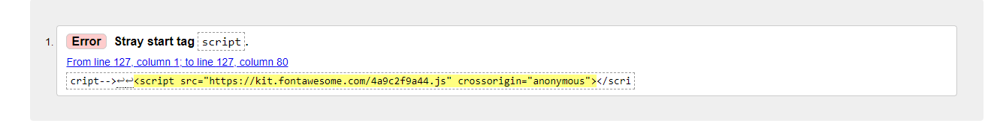
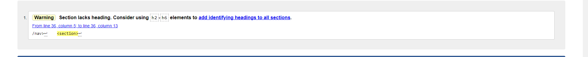

# Testing

## Code Validator 
The 'I'd Rather Be At Pemberley' website was tested thoroughly. All code was ran though [W3C html Validator](https://validator.w3.org/) and [W3C CSS Validator](https://jigsaw.w3.org/css-validator/) to validate it. Minor bugs were found and fixed so that no errors were returned.

#### HTML Validator Results
* Home Page

* Events Page

* Join Page

#### CSS Validator Results

---

# User Testing 

#### First Time Visitor Goals

* As a first time visitor, I want to easily navigate the site.

  1. On entering the site users are met with a clear navigation bar.
  2. The user can easily know which page of the website they are one with as the background color change of the title on the navigation title highlights which page the user is visiting.
  3. Above the navigation bar the site logo is clicked to easily return to the home page.

* As a first time visitor, I want To find information on the book club, what type of books read and where it takes place. 

  1. The About The Club section below the hero image provides all imformation on the book club and is in four sections of information with title quetions for users to easily find answers about the book club.

* As a first time visitor, I want to easily find their social media links .

  1. The site contains social media links through easy to find icons located at the bottom of the webpage in the footer.

#### Returning Visitor Goals

* As a returning visitor, I want to find out how I can join the book club.

  1. The Join page provides an easy to fill join form with four input fields including first and last name, email and an input t fill about the users reasons for joining the book club.
  2. A 'Join Us' button sits at the bottom of the form that is easily distinguishable from the other input fields.

* As a returning visitor, I want to easily find contact information if I have queries before joining the book club.

  1. Contact informaton for the book club is located in the footer of the website above the social media links.
  2. It is laid out to be easily read and provides a phone number and email to reach the book club.

#### Frequent User Goals
* As a first time visitor, I want to be able to check for any upcoming book club events.

  1. The sites Events page has easy to read sections detailing upcoming events including time, date and place of the event as well as information on which book is being read.
  2. The event sections also contain a link to the Goodreads website which provides more informatiom on the books being read.

* As a first time visitor, I want to be able to check what the book club is currently reading before attending the meet up.

  1. Frequent users can find the book that is currently being read at the bottom of the webpage above the footer.
  2. It highlights the book being currently read by the book club.
  3. There is also a link to the events page that changes to a pink font color when a mouse hovers on it showing it can be clicked, so that the user can find information on when the book will be reviewed.

  # Futher Testing

  * Responsive design testing for the website was carried out using [Google Chrome Dev Tools](https://www.google.com/chrome/dev/), [Website Planet](https://www.websiteplanet.com/) and [Responsive Design Checker](https://responsivedesignchecker.com/)
  * The website was checked on various devices such as Iphone 5/SE, Iphone X, Samsung Galay S8+, Nokia N9, Ipad, Galaxy Tab, Laptop and Desktop.

  * This Website was tested on the browsers Google Chrome, Safari, Microsoft Edge , Internnet Explorer and Mozilla Firefox.

  * Testing was done to make sure all links work correctly and opened in a new tab.
  * Family and Friends where asked to asked to help point out any bugs in the website and proofread the documentation.
 

  # Known Bugs
  ### During Validation a few bugs were shown including:

  ### The first bug was an error which meant the link to the website pages was not working.

   

  * ### This was resolvd by containg the link with the list item.

  ### The secong by was an error with the font awesome script.

  

  * ### This was resolved by removing the duplicate boby tag that had accidently been placed in the code.

  ### The third bug was an error with the hero images on both the Home and Events page.

  

  * ### This was resolved by removing the section tag that surrounded the div tag.

